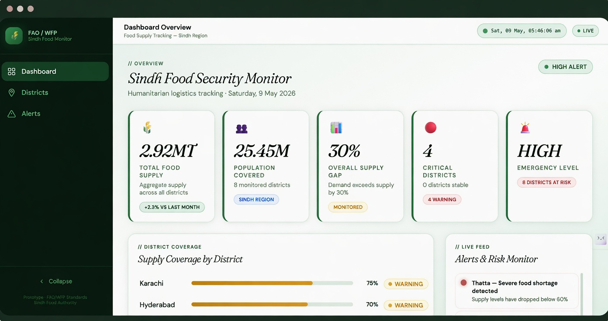
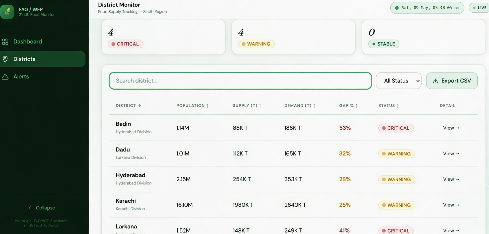
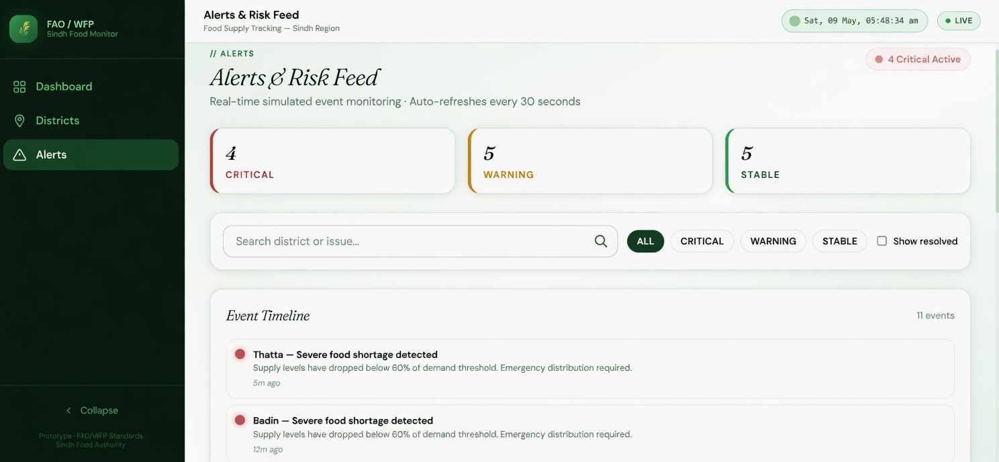

<div align="center">



<br><br>

# Sindh Food Security Monitor
### Humanitarian Logistics Intelligence — FAO / WFP Aligned

**Real-time food supply tracking across 8 Sindh districts — live alerts, IPC classification, district-level gap analysis**

[](https://sindh-food-supply-tracking-dashboar.vercel.app/dashboard)
[](https://sindh-food-supply-tracking-dashboar.vercel.app/dashboard)
[](https://sindh-food-supply-tracking-dashboar.vercel.app/districts)
[](https://sindh-food-supply-tracking-dashboar.vercel.app/alerts)


</div>

---

## 🎯 The Problem

Sindh is Pakistan's most food-stressed province — home to 25.45M people across 8 districts with vastly different supply realities. Despite this:

- Field officers have no real-time view of district-level supply gaps
- Critical shortages (IPC Phase 4) are identified days after they occur
- No unified dashboard exists for FAO/WFP field coordinators to act on
- Data lives in spreadsheets, not operational systems

**36.9% of rural Sindh faces food insecurity** (WFP Pakistan, 2024). The monitoring infrastructure to respond doesn't exist at scale.

---

## 💡 The Solution

A humanitarian-grade food security monitoring platform built to FAO/WFP operational standards — tracking supply, demand, and gap metrics across all 8 Sindh districts with live alert classification and CSV export for field use.

> Aligned with FAO Strategic Framework 2022–2031 and WFP Emergency Response Protocol ERP-7.
> Supports SDG 2 (Zero Hunger) · SDG 9 (Infrastructure) · SDG 17 (Partnerships)

---

## 📊 Live Platform Metrics

| Metric | Value |
|---|---|
| 🏙️ Districts Monitored | 8 (full Sindh coverage) |
| 👥 Population Covered | 25.45M |
| 🌾 Total Food Supply Tracked | 2.92 MT |
| 🚨 Overall Supply Gap | 30% (demand exceeds supply) |
| ⚠️ Critical Districts | 4 (IPC Phase 4 — Acute) |
| 🔴 Emergency Level | HIGH — 8 districts at risk |
| 🔄 Alert Refresh Rate | Every 30 seconds |

---

## ✨ Features

### 📊 Dashboard Overview
Live KPI cards showing total food supply, population covered, supply gap percentage, critical district count, and emergency level. District coverage bars with real-time status classification (Critical / Warning / Stable).

### 🗺️ District Monitor
Sortable, searchable table across all 8 districts showing population, supply (T), demand (T), gap percentage, and IPC status. One-click drill-down into each district. CSV export for field teams.

**Districts tracked:** Badin · Dadu · Hyderabad · Karachi · Larkana · Sukkur · Thatta · Mirpur Khas

### 🚨 Alerts & Risk Feed
Real-time event timeline with severity classification (Critical / Warning / Stable). Auto-refreshes every 30 seconds. Searchable by district or issue type. Filter by severity. Show/hide resolved events.

### 📱 Responsive Design
Collapsible sidebar, mobile-optimized layout for field use on low-bandwidth connections.

---

## 🧠 IPC Classification System

| Status | Gap Threshold | IPC Phase | Meaning |
|---|---|---|---|
| 🔴 Critical | Gap > 40% | Phase 4 — Acute | Emergency distribution required |
| 🟡 Warning | Gap 20–40% | Phase 3 — Stressed | Intervention needed |
| 🟢 Stable | Gap < 20% | Phase 1–2 | Monitoring only |

Based on **IPC (Integrated Food Security Phase Classification)** international standards.

---

## 🖼️ Screenshots

<div align="center">

**Dashboard Overview**


**District Monitor**


**Alerts & Risk Feed**


</div>

---

## 🛠️ Tech Stack

| Layer | Technology |
|---|---|
| **Framework** | Next.js 14 (App Router) |
| **Language** | TypeScript |
| **UI** | React 18 + Tailwind CSS |
| **Charts** | Recharts |
| **Fonts** | Fraunces (display) + DM Sans (body) |
| **Deployment** | Vercel |
| **Data Standards** | FAO Food Balance Sheet · IPC · WFP ERP-7 |

---

## 📐 Data Methodology

### Food Demand Calculation
```
demand_tons = (population × 164 kg/person/year) / 1000
```
Based on FAO South Asia baseline of 2,100 kcal/day → ~164 kg grain equivalent/year.

### API Endpoints

| Endpoint | Method | Returns |
|---|---|---|
| `/api/districts` | GET | All 8 districts with computed metrics |
| `/api/summary` | GET | Aggregated KPIs and emergency level |
| `/api/alerts` | GET | Alert feed (filter: `?type=Critical`) |
| `/api/commodities` | GET | Commodity supply/demand/price data |

---

## 🚀 Quick Start

### Prerequisites
- Node.js 18+
- npm 10+

### Setup

```bash
# 1. Clone
git clone https://github.com/Mujahidaryan/Sindh_FoodSupply_Tracking_Dashboard.git
cd Sindh_FoodSupply_Tracking_Dashboard

# 2. Install
npm install

# 3. Run
npm run dev
# Open http://localhost:3000 — redirects to /dashboard
```

### Build for Production
```bash
npm run build
npm start
```

---

## ☁️ Deploy on Vercel

1. Push to GitHub
2. Go to [vercel.com/new](https://vercel.com/new) → Import this repo
3. Framework auto-detected as Next.js
4. Click **Deploy** — live in ~60 seconds

---

## 🌍 International Standards Alignment

| Standard | Application |
|---|---|
| **IPC Phase Classification** | District status thresholds (Critical/Warning/Stable) |
| **FAO Food Balance Sheet** | Per-capita consumption baseline (164 kg/year) |
| **WFP ERP-7** | Alert messaging templates |
| **PDMA Sindh** | District administrative boundaries |
| **SDG 2** | Zero Hunger — direct alignment |

---

## 👤 Author

**Muhammad Mujahid** — Full Stack Developer, Karachi, Pakistan

[](https://linkedin.com/in/muhammad-mujahid-dev)
[](https://github.com/Mujahidaryan)
[](https://my-portfolio-swart-nu-73.vercel.app)
[](mailto:mujahidaryan222149@gmail.com)

---

## 📄 License

MIT © 2026 Muhammad Mujahid — Free to use for educational, research, and humanitarian purposes.

---

<div align="center">
  <sub>Built for Sindh's food security. Aligned with FAO / WFP humanitarian standards.</sub>
</div>
